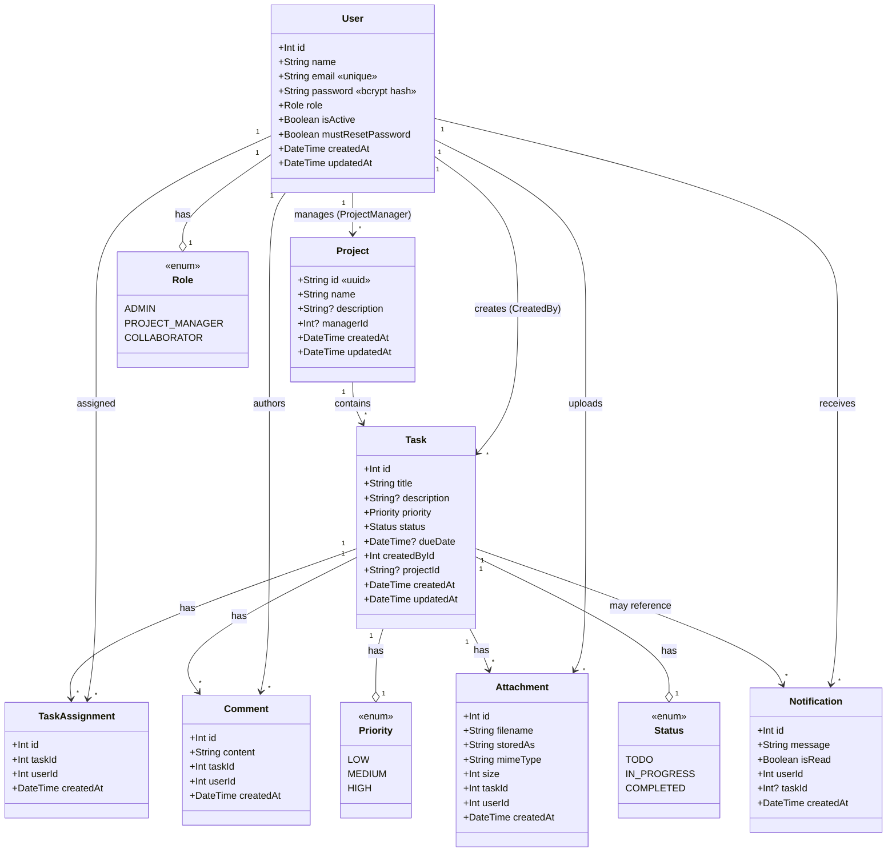

# Class / Domain Model Diagram

Domain model of the Task Management System, derived from `backend/prisma/schema.prisma`.
(GitHub renders the Mermaid diagram below.)

## Relationships & cascade rules

| Relationship | Cardinality | On delete |
|---|---|---|
| User → Project (manager) | 1 user manages many projects | `SetNull` (project keeps existing, manager cleared) |
| User → Task (creator) | 1 user creates many tasks | `Cascade` (deleting user deletes their created tasks) |
| Project → Task | 1 project has many tasks | `SetNull` (task survives, `projectId` cleared) |
| Task ↔ User (assignment) | many-to-many via `TaskAssignment` (unique `taskId+userId`) | `Cascade` both sides |
| Task → Comment / Attachment / Notification | 1 task has many | `Cascade` |
| User → Comment / Attachment / Notification | 1 user has many | `Cascade` |
| Notification → Task | optional (`taskId?`) — admin-update notifications have no task | `Cascade` |

## Notes
- `User.password` is always a bcrypt hash; it is never returned in API responses (`select` blocks exclude it).
- `Task` ↔ `User` assignment is a join entity (`TaskAssignment`) rather than an implicit relation, enabling the unique constraint and per-assignment `createdAt`.
- `Notification.taskId` is optional so administrative notifications (role change, project-manager assignment) can exist without a task.
