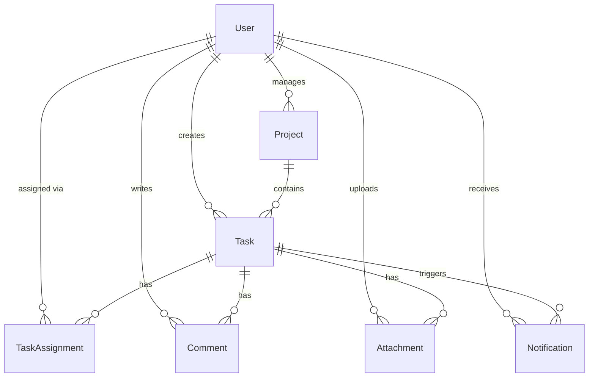

# Database Design

## Overview
This document describes the database design for the Task Management System (TMS). The database is implemented using MySQL and managed via Prisma ORM.

## Entities and Relationships

### User
Represents a user in the system.
- `id`: Int (Primary Key)
- `name`: String
- `email`: String (Unique)
- `password`: String
- `role`: Enum (ADMIN, PROJECT_MANAGER, COLLABORATOR)
- `isActive`: Boolean
- `mustResetPassword`: Boolean
- `createdAt`: DateTime
- `updatedAt`: DateTime

### Project
Represents a project containing multiple tasks.
- `id`: String (UUID, Primary Key)
- `name`: String
- `description`: String?
- `managerId`: Int? (Foreign Key to User)
- `createdAt`: DateTime
- `updatedAt`: DateTime

### Task
Represents a specific task within a project.
- `id`: Int (Primary Key)
- `title`: String
- `description`: String?
- `priority`: Enum (LOW, MEDIUM, HIGH)
- `status`: Enum (TODO, IN_PROGRESS, COMPLETED)
- `dueDate`: DateTime?
- `createdById`: Int (Foreign Key to User)
- `projectId`: String? (Foreign Key to Project)
- `createdAt`: DateTime
- `updatedAt`: DateTime

### TaskAssignment
A join table connecting Users and Tasks for assignment.
- `id`: Int (Primary Key)
- `taskId`: Int (Foreign Key to Task)
- `userId`: Int (Foreign Key to User)
- `createdAt`: DateTime
- *Unique Constraint*: `[taskId, userId]`

### Comment
Represents a comment made by a user on a specific task.
- `id`: Int (Primary Key)
- `content`: String
- `taskId`: Int (Foreign Key to Task)
- `userId`: Int (Foreign Key to User)
- `createdAt`: DateTime
- `updatedAt`: DateTime

### Notification
Represents system notifications sent to users.
- `id`: Int (Primary Key)
- `message`: String
- `isRead`: Boolean
- `userId`: Int (Foreign Key to User)
- `taskId`: Int? (Foreign Key to Task)
- `createdAt`: DateTime

### Attachment
Represents files attached to tasks by users.
- `id`: Int (Primary Key)
- `filename`: String
- `storedAs`: String
- `mimeType`: String
- `size`: Int
- `taskId`: Int (Foreign Key to Task)
- `userId`: Int (Foreign Key to User)
- `createdAt`: DateTime

## Relationships Summary
- **User -> Task (Creator)**: One-to-Many
- **User -> Task (Assignment)**: Many-to-Many (via `TaskAssignment`)
- **Project -> Task**: One-to-Many
- **Project -> User (Manager)**: Many-to-One
- **Task -> Comment**: One-to-Many
- **User -> Comment**: One-to-Many
- **Task -> Attachment**: One-to-Many
- **User -> Attachment**: One-to-Many
- **User -> Notification**: One-to-Many

## Database Diagram (Mermaid)

