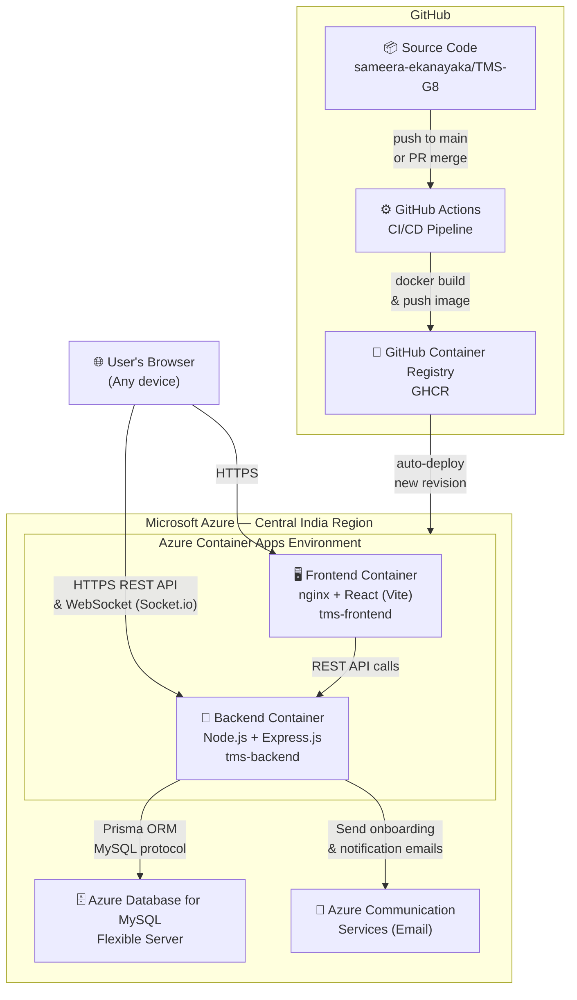

# Deployment Diagram

Architecture of the deployed Task Management System on **Microsoft Azure**.
GitHub renders the Mermaid diagram below.

## Component Descriptions

| Component | Technology | Role |
|---|---|---|
| **User's Browser** | Any device / browser | End-user access point |
| **GitHub Repo** | GitHub | Source of truth for all code |
| **GitHub Actions** | GitHub Actions (YAML workflows) | Builds Docker images on push to `main`; pushes to GHCR |
| **GHCR** | GitHub Container Registry | Hosts Docker images for frontend and backend |
| **Frontend Container** | nginx + React (Vite) + Tailwind CSS | Serves the SPA; nginx proxies API calls |
| **Backend Container** | Node.js + Express.js + Socket.io | REST API + real-time WebSocket events |
| **Azure Container Apps** | Azure Container Apps (Central India) | Serverless container hosting for both services |
| **Azure MySQL Flexible Server** | Azure Database for MySQL | Relational database; accessed via Prisma ORM |
| **Azure Communication Services** | Azure Email | Sends onboarding emails with temporary passwords |

## Live URLs

| Service | URL |
|---|---|
| Frontend | `https://tms-frontend.kindpebble-85fc4cff.centralindia.azurecontainerapps.io` |
| Backend API | `https://tms-backend.kindpebble-85fc4cff.centralindia.azurecontainerapps.io` |
| Swagger Docs | `https://tms-backend.kindpebble-85fc4cff.centralindia.azurecontainerapps.io/api-docs` |

## CI/CD Flow Summary

1. Developer pushes code or merges a PR into `main`
2. **GitHub Actions** workflow triggers automatically
3. Docker images are built (multi-stage build for both frontend and backend)
4. Images are pushed to **GitHub Container Registry (GHCR)**
5. **Azure Container Apps** pulls the new image and deploys a new revision with zero downtime
