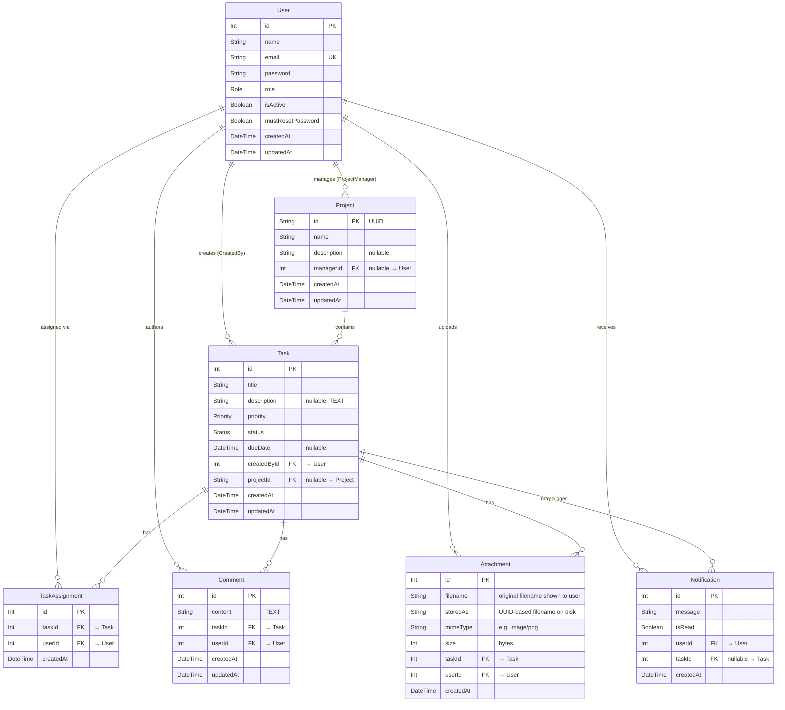

# Entity-Relationship (ER) Diagram

Derived from `backend/prisma/schema.prisma`. GitHub renders the Mermaid diagram below.

## Enums

| Enum | Values |
|---|---|
| `Role` | `ADMIN`, `PROJECT_MANAGER`, `COLLABORATOR` |
| `Priority` | `LOW`, `MEDIUM`, `HIGH` |
| `Status` | `TODO`, `IN_PROGRESS`, `COMPLETED` |

## Cascade & Delete Rules

| Relationship | On Delete |
|---|---|
| `User` → `Project` (manager) | `SetNull` — project kept, `managerId` cleared |
| `User` → `Task` (creator) | `Cascade` — deletes all tasks they created |
| `User` → `TaskAssignment` | `Cascade` |
| `User` → `Comment` | `Cascade` |
| `User` → `Attachment` | `Cascade` |
| `User` → `Notification` | `Cascade` |
| `Project` → `Task` | `SetNull` — task survives, `projectId` cleared |
| `Task` → `TaskAssignment` | `Cascade` |
| `Task` → `Comment` | `Cascade` |
| `Task` → `Attachment` | `Cascade` |
| `Task` → `Notification` | `Cascade` |

## Unique Constraints

- `User.email` — unique across the system
- `TaskAssignment(taskId, userId)` — a user can only be assigned to a task once

## Notes

- `User.password` is always stored as a **bcrypt hash**. It is excluded from all API responses via Prisma `select`.
- `Attachment.storedAs` is a UUID-based filename used internally on disk; `filename` is the original name shown to users.
- `Notification.taskId` is optional — administrative notifications (e.g. role change, project manager assignment) have no associated task.
- The `Task ↔ User` assignment is a **join entity** (`TaskAssignment`) rather than a direct relation, enabling the unique constraint and a per-assignment `createdAt` timestamp.
